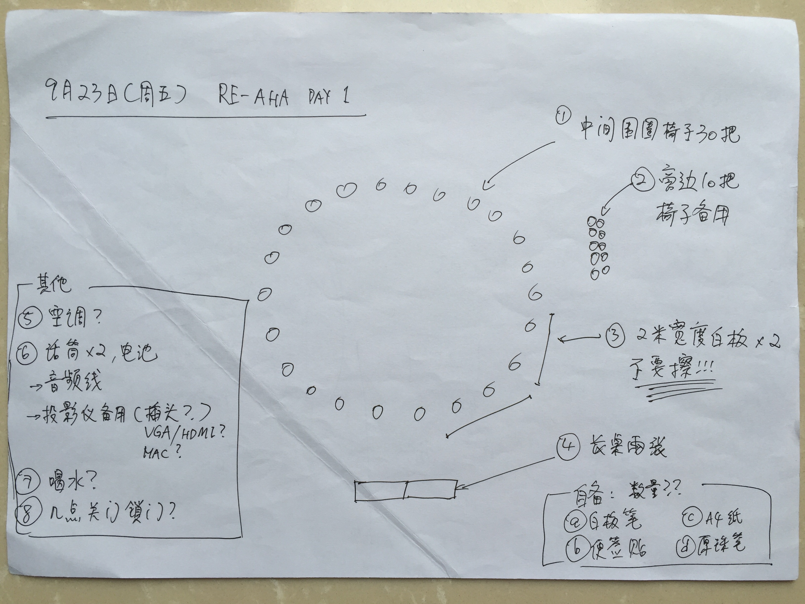
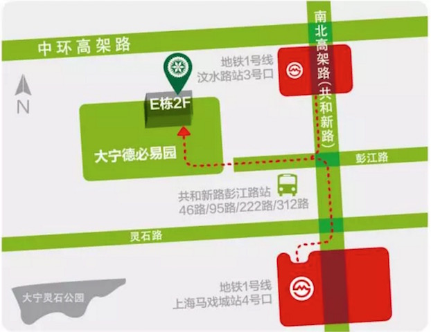
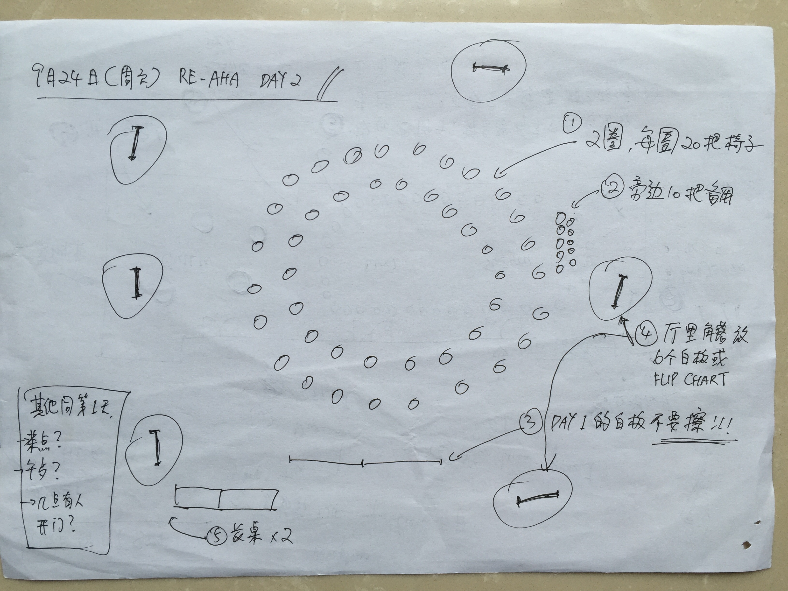

Welcome to ReAHA Gathering
===

23号晚餐
====

破冰：
3轮，7分钟/轮
每轮问题不一样

##### 第一轮

	我擅长 xxx？
	我期待 xxx？
	我想玩 xxx？

##### 第二轮

	我擅长 xxx？
	我期待 xxx？
	我想玩 xxx？

##### 第三轮

	我最推荐关注的三个人是 xxx。

##### 黄金30秒（分享话题，有些想法预热）
	
	- 我明天想跟大家分享 xxxx
	- 想跟大家讨论一下关于 xxx 
	- 想一起学习一下 xxx

需要提前准备：纸、笔。

24号聚会 Unconferencing
====
Workface场地
---

地址：上海闸北区彭江路602号 大宁德必易园 e 栋408f

* 3间会议室
* 1个大厅
* 若干可以 Pair 的小角落
* 1个楼顶天台
* 1个可以烧烤的院子
* 1台电视机
* 2台投影

Agenda Proposal
----
##### now ~ 9.24
	收集话题，准备当天的话题列表
##### 9.24 日程 Agenda
	9:30 AM - 10:00 参与话题，发起新话题，行程今日 Agenda(现场30秒)
	
	10:00 - 11:30 Session 1
	11:30 - 11:45 Session 1 Sharing

	12:00 - 13:30 午餐 Lunch（Session 2）
	
	13:30 - 15:00 Session 3
	15:00 - 15:15 Session 3 Sharing
	
	15:15 - 16:45 Session 4
	16:45 - 17:00 Session 4 Sharing

	17:00 - 17:20 准备最后的分享 Presentation Preparation
	17:20 - 17:30 分享我今天的新灵感 Final Presentation Of My New Insight

Unconferencing
---

Follow this link for more detail: 
[Unconference](http://unconference.net/unconferencing-how-to-prepare-to-attend-an-unconference/)

* 志愿者记录更新聊天地图

* 无论是多年深思熟虑之后准备的演讲还是临时迸发的新奇想法，都值得说道说道。From the well thought out pre-prepared talk reflecting years of research and practice to the spur of the moment ‘new idea’ that would be fun to talk about.
* 无论是炫酷吊炸天的工具演示，还是白板上寥寥几笔的写写画画，都拿来吐槽吐槽。From the demonstration of a working tool to the whiteboarding of something completely new.

召集一场讨论 Convening a session 
---
可能的讨论的形式……

####Types of sessions…

##### 比较长的正式演讲 The longer formal presentation
这样的情景下，这种互动式的正式演讲可能会比较困难；不过如果你确实有准备得很充分的想法在这里发布，搞个打的，你完全可以在这里试试。

This is tricky, because it’s difficult to make a formal presentation interactive. But if you have a big, well-developed idea you can pull it off.
##### 浅讨论 A short presentation to get things started
发起者可以发起5~15分钟基于已有的某种话题的探讨或者联合吐槽。

5-15 minutes of prepared material/comments by the session leader followed by an interactive discussion
##### 深讨论 Group discussion
发起者提出了一个他自己很感兴趣的话题，希望深入讨论。其他人则可以过来加入他们的讨论，从而引发了一场有趣的讨论。

Someone identifies a topic they are interested in, others come to join the conversation and an interesting discussion happens
##### 我想问点问题 My Big (or Little) Question
或许有些问题一直比较困扰你，一直没找到答案，而你知道组里的其他人潜在是可能能回答这个问题的。当然这种形式也可以单纯只是找个有共同语言的人一起聊点什么东西。

You have a question you want to know the answer to, and you think others in the group could help you answer it. This format could also just be the seed of a conversation.
##### 展示 Show and tell 
你可能参与了某个挺有趣的项目，可以用这种方式发起一个 demo，或者准备点什么可以让大伙体验体验。也可以发起一个让大家轮流分享自己觉得不错的工具、方法（或许可以分主题），举个例子：我如何从无到有准备了一次小组关键对话。

You have a cool project, a demo, or just something to show and let people play with that is the springboard for all the conversation in the session. Alternatively, you can invite others to bring their own items to show and tell (perhaps with a theme), and everyone takes a turn sharing.
##### 一起来学学如何xxx Learn how to do X

如果你想教点东西，这是种简单有效的方案。准备好需要用到的道具，比如电脑，海报纸，文具等，提出一个计划，让5~15人一起听听，学习如何上手做点啥。比如：5分钟学会画一个栩栩如生的人物头像。

If you’re inclined to teach, this can be simple and effective. Bring the equipment that you need, and have a plan that will let you teach five, ten, or 15 people how to do something all at the same time.

对所有人的建议 Advice for everyone at unconference…
===

##### 跟大伙一起汇成一条心流 Go with the flow 

这个聚会目的是帮助你和所有参与者在共同时间和空间中，相互学习偷东西。

This event is intended to help you and all the other grantees find the time and space to talk with and learn from each other.

##### 跟随自己的兴趣 Follow your passion 
找自己感兴趣的话题，并参与进去。

Go to the sessions that interest you.

##### 成年人对自己能学习到的东西负责 Take responsibility for your own learning 
如果有话题没有出现在日程上，而你又很想找人聊聊的，上！作为成年人，有责任把这样的话题抛出来让大家听到。

If there are topics you are really interested in that don’t appear on the agenda at first, you need to put them on there.

 